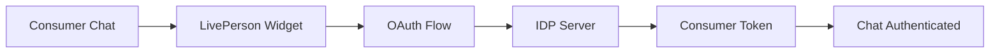

# LivePerson IDP Server - Architecture Documentation

## Overview

The LivePerson IDP Server is a comprehensive Identity Provider server that supports multiple authentication protocols for LivePerson integration testing. The server has evolved from a monolithic architecture into a well-organized, modular system supporting OAuth 2.0, OpenID Connect (OIDC), and SAML 2.0 with seamless LivePerson platform integration.

## 🏗️ Architecture

### **Modular Structure**

```
idp-server/
├── server.js                 # Main server with OIDC discovery (320 lines)
├── config/
│   └── config.js             # Centralized configuration management
├── utils/
│   ├── pkce.js               # PKCE utilities for OAuth security
│   └── jwt.js                # JWT/JWE utilities with JWKS support
├── middleware/
│   ├── express.js            # Express middleware with ngrok support
│   └── logging.js            # Enhanced request logging with token analysis
├── routes/
│   ├── oauth.js              # OAuth 2.0/OIDC routes with response modes
│   └── saml.js               # SAML 2.0 routes with Auth0 & Denver SSO
├── ui/
│   └── templates.js          # Dynamic HTML template generation
└── saml/
    ├── saml-core.js          # Core SAML functionality
    ├── saml-encryption.js    # Dynamic certificate handling
    ├── saml-response.js      # SAML response generation
    └── denver-sso.js         # Denver-specific SAML implementation
```

### **Architecture Evolution**

| Metric | Original | Current | Improvement |
|--------|----------|---------|-------------|
| Main file size | ~2,950 lines | 320 lines | 89% reduction |
| Modules | 1 | 12 | Modular architecture |
| Protocols | OAuth 2.0 | OAuth 2.0, OIDC, SAML | Multi-protocol support |
| Flows | Basic | 6+ flows | Comprehensive coverage |
| LivePerson Integration | Basic | Advanced | Production-ready |

## 📋 Supported Authentication Protocols

### **🔄 OpenID Connect (OIDC)**
**Primary use case:** LivePerson Agent SSO

#### Front Channel (Implicit Flow)
- **Response Type:** `id_token`
- **Response Mode:** `form_post` (recommended) or `fragment`
- **Client:** `MyIdPOIDCFC`
- **Flow:** Direct token delivery via HTML form POST
- **Security:** Minimal JWT payload for agent authentication

#### Back Channel (Authorization Code Flow)
- **Response Type:** `code`
- **Client:** `MyIdPOIDCBC`
- **Flow:** Two-step authentication (code → token exchange)
- **Standard:** OAuth 2.0 compliant with `code=` parameter
- **Security:** Server-to-server token exchange

#### OIDC Discovery & Standards
- **Discovery Endpoint:** `/.well-known/openid-configuration`
- **JWKS Endpoint:** `/.well-known/jwks.json`
- **UserInfo Endpoint:** `/userinfo`
- **Dynamic Configuration:** ngrok-aware URL generation
- **Standards Compliance:** Full OpenID Connect specification

### **🔐 SAML 2.0**

#### Auth0 SAML Integration
**Primary use case:** SP-initiated SAML with LivePerson

- **Account Support:** 81785735 (Alpha environment)
- **Environment Awareness:** Alpha, NA, EU, APAC configurations
- **Certificate Management:** Dynamic download (lpsso2026, lpsso2027, lpsso2028)
- **Format Conversion:** Automatic PEM-to-DER conversion
- **Encryption:** Optional with LivePerson certificates

#### Denver SAML Integration  
**Primary use case:** Legacy Denver agent authentication

- **Custom Attributes:** `loginName`, `siteId`, agent-specific data
- **Response Generation:** Custom SAML assertion creation
- **Encryption Support:** LivePerson certificate integration
- **Destination URLs:** Configurable target endpoints

### **👤 OAuth 2.0 Consumer Authentication**
**Primary use case:** LivePerson Consumer Authentication connector

- **Implicit Flow:** Consumer chat authentication
- **Authorization Code Flow:** Server-side consumer authentication
- **PKCE Support:** Enhanced security for public clients
- **JWE Encryption:** Optional token encryption with LivePerson certificates

## 🔧 Module Details

### **server.js** - Main Server (320 lines)
Enhanced main server with OIDC discovery and multi-protocol support.

**Key Features:**
- OpenID Connect discovery endpoint
- Dynamic URL generation for ngrok/proxy environments
- Protocol-specific header handling
- Comprehensive request routing
- State management for all authentication flows

### **routes/oauth.js** - OAuth/OIDC Routes
Complete OAuth 2.0 and OpenID Connect implementation.

**Endpoints:**
- `GET /authorize` - Authorization endpoint (all flows)
- `POST /token` - Token exchange with ngrok bypass headers
- `GET /userinfo` - OIDC user information endpoint
- `POST /oidc/front-channel/initiate` - Front channel flow initiation
- `POST /oidc/back-channel/initiate` - Back channel flow initiation

**Features:**
- Response mode support (`fragment`, `query`, `form_post`)
- OAuth 2.0 standard compliance (`code=` vs `ssoKey=`)
- Client authentication and validation
- PKCE challenge verification
- Dynamic issuer detection with protocol enhancement

### **routes/saml.js** - SAML Routes & UI
Complete SAML 2.0 implementation with multiple integration types.

**Endpoints:**
- `GET /agentsso-oidc-auth0` - OIDC testing interface
- `GET /agentsso-auth0` - Auth0 SAML testing interface  
- `GET /agentsso-denver` - Denver SAML testing interface
- `POST /sso/saml` - SAML SSO endpoint
- `POST /generate-saml-assertion` - Denver SAML generation

**Features:**
- Multi-tab UI for different authentication flows
- Copy-to-clipboard functionality for configuration values
- Dynamic certificate downloading and conversion
- Environment-aware configuration
- Form validation and error handling

### **utils/jwt.js** - JWT/JWKS Utilities
Enhanced JWT utilities with OIDC support and certificate management.

**Functions:**
- `createToken(payload, options)` - JWT/JWE token creation with dynamic issuers
- `createMinimalAgentToken(payload)` - OIDC agent-specific tokens
- `generateJWKS(publicKey)` - JWKS endpoint response generation
- `detectIssuerFromRequest(req)` - Dynamic issuer detection with ngrok support
- `pemToJwk(pemKey)` - PEM to JWK conversion for key management

### **saml/saml-encryption.js** - Enhanced Certificate Management
Advanced certificate handling with dynamic downloading and format conversion.

**Functions:**
- `downloadAndConvertCertificate(certificateName)` - Dynamic certificate fetching
- `convertPemToDer(pemContent)` - Automatic format conversion
- `ensureCertificateExists(certificateName)` - Certificate availability verification
- `loadLivepersonCertificate(name)` - Multi-certificate support

### **middleware/logging.js** - Enhanced Request Logging
Advanced logging with token analysis and flow-specific information.

**Features:**
- Token format detection and analysis
- OIDC flow identification
- Client credential extraction and masking
- Request/response correlation
- 100-request rolling history
- Console and web dashboard integration

## 🔄 State Management & Configuration

### **Shared Application State**
```javascript
// Core authentication state
app.locals.encryptionEnabled = false;
app.locals.flowType = 'implicit';
app.locals.requestLogs = [];

// Certificate management
app.locals.signingPrivateKey = loadedPrivateKey;
app.locals.signingPublicKey = loadedPublicKey;
app.locals.lpEncryptionPublicKey = loadedLpCert;

// OIDC configuration
app.locals.oidcConfig = {
    frontChannelClient: 'MyIdPOIDCFC',
    backChannelClient: 'MyIdPOIDCBC',
    issuer: dynamicallyDetected,
    scopes: ['openid', 'profile', 'email']
};
```

### **Dynamic Configuration**
- **Environment Detection:** Automatic ngrok/proxy URL detection
- **Protocol Enhancement:** HTTP→HTTPS upgrade for ngrok environments
- **Client Management:** Per-flow client ID/secret configuration
- **Certificate Rotation:** Dynamic certificate downloading and caching

## 🌐 Integration Architecture

### **LivePerson Platform Integration**

#### Agent SSO (OIDC)


#### Consumer Authentication (OAuth)


### **Certificate & Security Architecture**

#### Dynamic Certificate Management
- **Runtime Download:** Certificates fetched as needed
- **Format Conversion:** Automatic PEM↔DER conversion
- **Multi-Certificate:** Support for multiple LivePerson environments
- **Graceful Fallback:** Signing-only mode when encryption unavailable

#### Security Layers
1. **Transport Security:** HTTPS enforcement for production flows
2. **Token Security:** RS256 signing, optional JWE encryption
3. **Flow Security:** PKCE for public clients, state parameters
4. **Certificate Security:** Proper certificate validation and rotation

## 🧪 Testing Architecture

### **Multi-Protocol Testing**
The server provides comprehensive testing interfaces for all supported protocols:

#### OIDC Testing (`/agentsso-oidc-auth0`)
- **Tabbed Interface:** Front Channel vs Back Channel
- **Configuration Section:** All endpoints and credentials with copy buttons
- **Flow Testing:** SP-initiated authentication with LivePerson
- **Debug Information:** Request/response logging and analysis

#### SAML Testing (`/agentsso-auth0`, `/agentsso-denver`)
- **Environment Selection:** Multi-environment support
- **Certificate Testing:** Dynamic certificate download validation
- **Encryption Testing:** Optional encryption with certificate selection
- **Response Validation:** SAML assertion generation and verification

### **Development Features**
- **Live Reload:** Nodemon integration for development
- **Request Monitoring:** Real-time request/response logging
- **State Debugging:** Visual state management and flow tracking
- **Error Handling:** Comprehensive error reporting and debugging

## 🚀 Deployment Considerations

### **Production Readiness**
- **Environment Variables:** Full configuration via environment
- **Certificate Management:** Secure certificate storage and rotation
- **Logging:** Production-grade logging with sensitive data masking
- **Health Checks:** Comprehensive health monitoring endpoints

### **Scalability**
- **Modular Architecture:** Easy horizontal scaling
- **Stateless Design:** Request-level state management
- **Certificate Caching:** Efficient certificate reuse
- **Connection Pooling:** Optimized for high-throughput scenarios

### **Security**
- **Credential Management:** Secure client secret storage
- **Certificate Validation:** Proper certificate chain validation
- **Token Expiration:** Configurable token lifetime management
- **Audit Logging:** Comprehensive security event logging

## 📈 Performance & Monitoring

### **Performance Optimizations**
- **Certificate Caching:** Reduced certificate download overhead
- **Template Caching:** Efficient HTML generation
- **State Management:** Minimal memory footprint
- **Request Batching:** Efficient logging and monitoring

### **Monitoring Capabilities**
- **Real-time Dashboard:** Live request monitoring
- **Flow Analytics:** Authentication flow success/failure tracking
- **Certificate Status:** Certificate expiration and validity monitoring
- **Performance Metrics:** Response time and throughput monitoring 